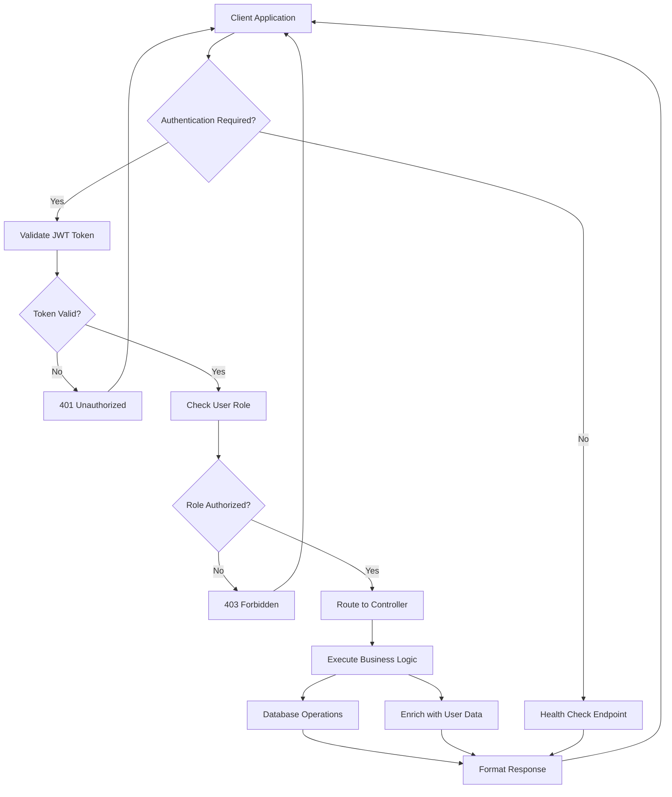
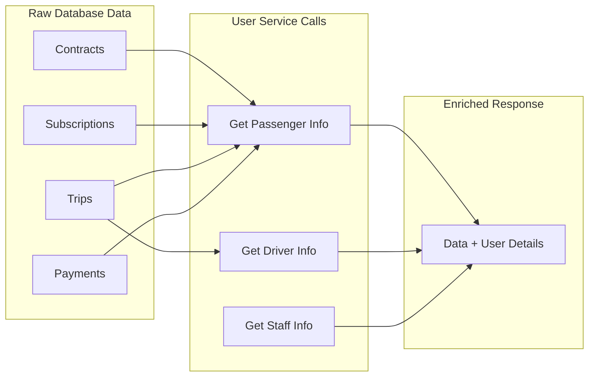
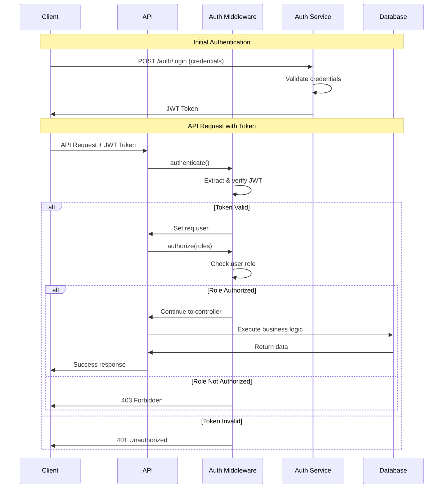
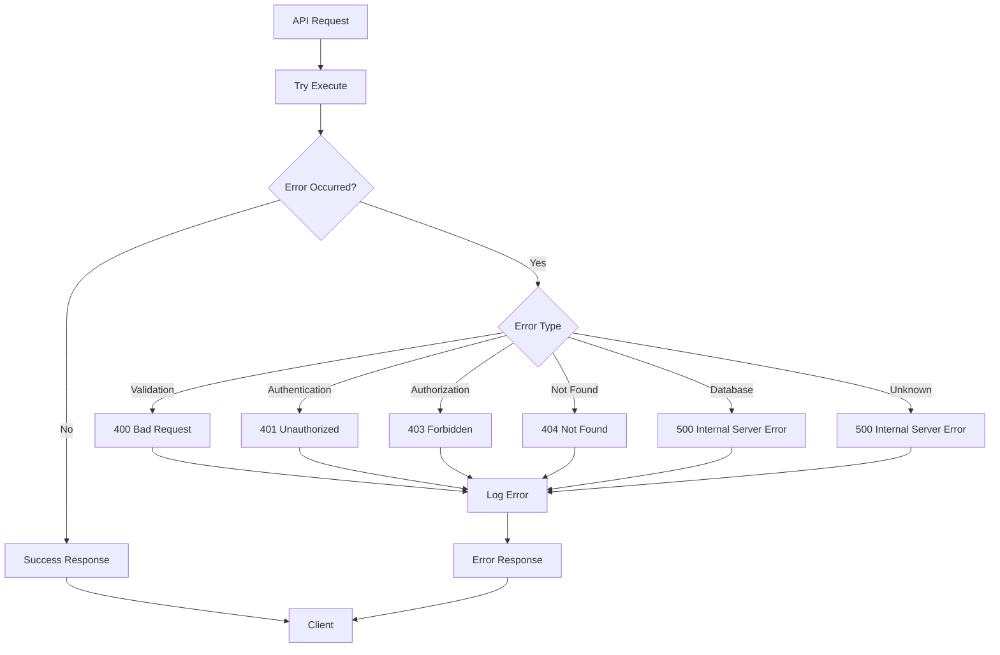
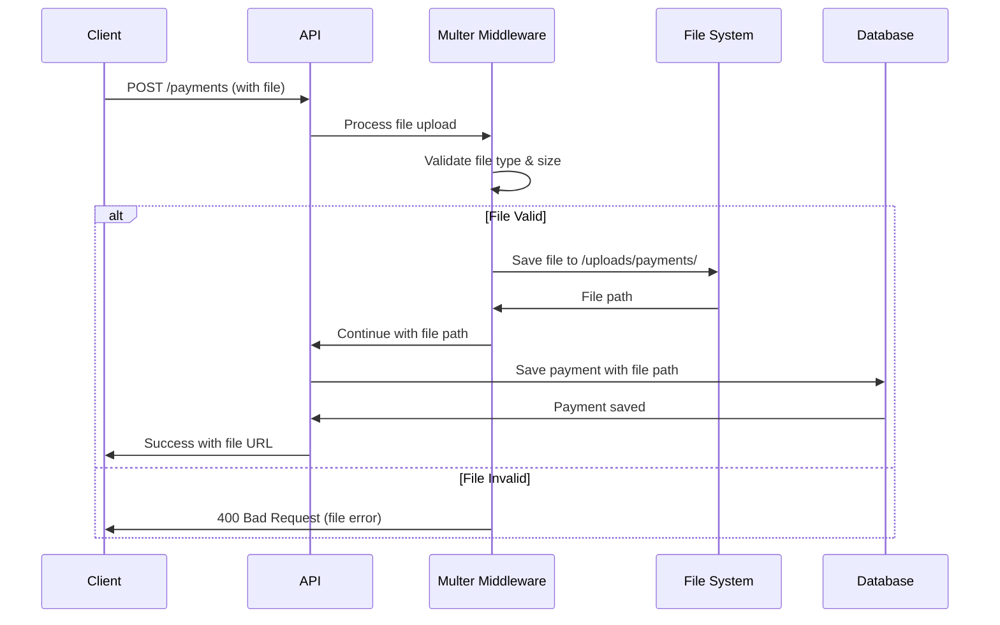

# API Endpoint Map

## Complete API Endpoint Structure

```
Contract Ride Service API
├── /api
    ├── 🏠 Health Check
    │   └── GET / → "Contract Service is UP!"
    │
    ├── 💰 Discounts (Admin Only)
    │   ├── POST /discounts → Create discount
    │   ├── GET /discounts → List all discounts
    │   ├── GET /discounts/:id → Get discount by ID
    │   ├── PUT /discounts/:id → Update discount
    │   └── DELETE /discounts/:id → Delete discount
    │
    ├── 📝 Contracts
    │   ├── POST /contracts → Create contract (Admin)
    │   ├── GET /contracts → List contracts (Role-based)
    │   ├── GET /contracts/:id → Get contract (Admin)
    │   ├── PUT /contracts/:id → Update contract (Admin)
    │   ├── DELETE /contracts/:id → Delete contract (Admin)
    │   ├── GET /contracts/active → Get active contracts
    │   ├── GET /contracts/individual → Get individual contracts
    │   ├── GET /contracts/group → Get group contracts
    │   └── GET /contracts/institutional → Get institutional contracts
    │
    ├── 💳 Payments
    │   ├── POST /payments → Create payment (Admin/Passenger)
    │   ├── GET /payments → List payments (Role-based)
    │   ├── GET /payments/:id → Get payment (Role-based)
    │   ├── PUT /payments/:id → Update payment (Admin)
    │   └── DELETE /payments/:id → Delete payment (Admin)
    │
    ├── 🔔 Subscriptions
    │   ├── POST /subscriptions → Create subscription (Admin/Passenger)
    │   ├── GET /subscriptions → List subscriptions (Role-based)
    │   ├── GET /subscriptions/:id → Get subscription (Role-based)
    │   ├── PUT /subscriptions/:id → Update subscription (Admin)
    │   └── DELETE /subscriptions/:id → Delete subscription (Admin)
    │
    ├── 📅 Schedules
    │   ├── POST /schedules → Create schedule (Admin)
    │   ├── GET /schedules → List schedules (Admin/Driver)
    │   ├── GET /schedules/:id → Get schedule (Admin/Driver)
    │   ├── PUT /schedules/:id → Update schedule (Admin/Driver)
    │   └── DELETE /schedules/:id → Delete schedule (Admin)
    │
    ├── 🚗 Trips
    │   ├── POST /trips → Create trip (Admin)
    │   ├── GET /trips → List trips (Role-based)
    │   ├── GET /trips/:id → Get trip (Role-based)
    │   ├── PUT /trips/:id → Update trip (Role-based)
    │   └── DELETE /trips/:id → Delete trip (Admin)
    │
    ├── 👤 Passenger Endpoints
    │   ├── GET /passenger/:id/driver → Get assigned driver
    │   ├── GET /passenger/:id/trips → Get trip history
    │   ├── PATCH /passenger/trip/:id/pickup → Confirm pickup
    │   ├── PATCH /passenger/trip/:id/end → Confirm trip end
    │   └── GET /passenger/subscription/price → Calculate fare
    │
    ├── 🚛 Driver Endpoints
    │   ├── GET /driver/:id/passengers → Get subscribed passengers
    │   ├── GET /driver/:id/contracts → Get contract expirations
    │   ├── GET /driver/:id/trips → Get assigned trips
    │   └── GET /driver/:id/schedule → Get upcoming schedule
    │
    └── 🛠 Admin Endpoints
        ├── POST /admin/contract/price → Set pricing rules
        ├── GET /admin/contract/price → Get current pricing
        ├── GET /admin/pricing/history → Get pricing history
        ├── PUT /admin/pricing/:id/deactivate → Deactivate pricing
        ├── POST /admin/subscription/calculate → Calculate subscription
        └── GET /admin/dashboard/stats → Get dashboard stats
```

## Endpoint Access Matrix

| Endpoint Category | Admin | Driver | Passenger | Guest |
|------------------|-------|--------|-----------|-------|
| Health Check | ✅ | ✅ | ✅ | ✅ |
| Discounts | ✅ | ❌ | ❌ | ❌ |
| Contracts | ✅ | 📖 | 📖 | ❌ |
| Payments | ✅ | ❌ | 📖/✏️ | ❌ |
| Subscriptions | ✅ | ❌ | 📖/✏️ | ❌ |
| Schedules | ✅ | 📖/✏️ | ❌ | ❌ |
| Trips | ✅ | 📖/✏️ | 📖/✏️ | ❌ |
| Passenger Endpoints | ✅ | ❌ | ✏️ | ❌ |
| Driver Endpoints | ✅ | ✏️ | ❌ | ❌ |
| Admin Endpoints | ✅ | ❌ | ❌ | ❌ |

**Legend:**
- ✅ Full Access
- 📖 Read Only
- ✏️ Own Data Only
- ❌ No Access

## Request/Response Flow Diagram



## Data Enrichment Flow



## Authentication Flow Detail



## Error Handling Flow



## Pricing Calculation Workflow

```mermaid
flowchart TD
    START[Coordinates Input] --> VALIDATE[Validate Coordinates]
    VALIDATE --> DISTANCE[Calculate Distance using Haversine]
    DISTANCE --> GET_PRICING[Get Active Pricing Rules]
    
    GET_PRICING --> PRICING_FOUND{Pricing Found?}
    PRICING_FOUND -->|No| ERROR[Return Error]
    PRICING_FOUND -->|Yes| CALCULATE[Calculate Fare]
    
    CALCULATE --> FORMULA[Base Fare + (Distance × Rate/KM)]
    FORMULA --> MIN_CHECK[Check Minimum Fare]
    MIN_CHECK --> FINAL[Final Fare = MAX(Calculated, Minimum)]
    
    FINAL --> MONTHLY[Calculate Monthly Cost × 22 days]
    MONTHLY --> RESPONSE[Return Calculation Details]
    
    ERROR --> CLIENT[Client Response]
    RESPONSE --> CLIENT
```

## File Upload Process



This comprehensive API endpoint map and workflow documentation provides a complete overview of the Contract Ride Service architecture, showing how all components work together to provide a robust ride management platform.