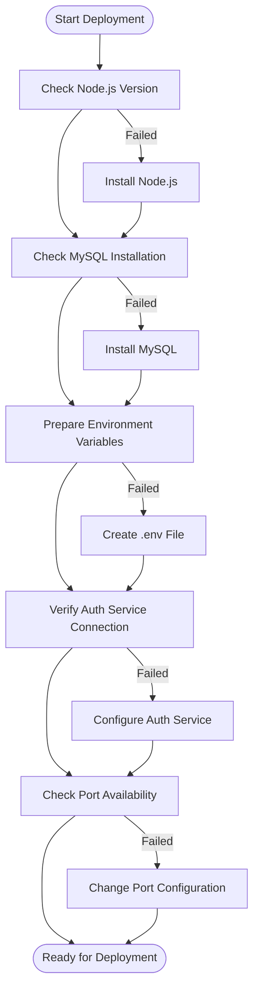

# Deployment Guide - Contract Ride Service

## System Requirements

### Minimum Requirements
- **Node.js**: v16.0.0 or higher
- **MySQL**: v8.0 or higher
- **Memory**: 2GB RAM
- **Storage**: 10GB available space
- **OS**: Linux (Ubuntu 20.04+), macOS, or Windows 10+

### Recommended Requirements
- **Node.js**: v18.0.0 or higher
- **MySQL**: v8.0.30 or higher
- **Memory**: 4GB RAM
- **Storage**: 50GB available space
- **OS**: Ubuntu 22.04 LTS

## Pre-deployment Checklist



## Environment Setup

### 1. Clone Repository
```bash
git clone <repository-url>
cd contract-ride-service
```

### 2. Install Dependencies
```bash
npm install
```

### 3. Environment Configuration
Create `.env` file:
```bash
cp ".env copy" .env
```

Edit `.env` with your configuration:
```bash
# Database Configuration
DB_HOST=localhost
DB_NAME=contract_service_db
DB_USER=root
DB_PASSWORD=your_secure_password

# Server Configuration
PORT=3000

# JWT Configuration
JWT_SECRET=your_very_secure_jwt_secret_key_here
JWT_EXPIRES_IN=7d

# Auth Service Integration
AUTH_BASE_URL=https://authservice.capitalinvestmenttradingplc.com/api
PASSENGER_LOOKUP_URL_TEMPLATE=${AUTH_BASE_URL}/passengers/{id}
DRIVER_LOOKUP_URL_TEMPLATE=${AUTH_BASE_URL}/drivers/{id}
AUTH_SERVICE_BEARER=your_service_bearer_token

# Optional: JWT Verification via JWKS
JWT_ISSUER=https://authservice.capitalinvestmenttradingplc.com/
JWT_AUDIENCE=my-api

# Optional: Timeout Configuration
USER_SERVICE_TIMEOUT_MS=5000
HTTP_TIMEOUT_MS=5000
```

## Database Setup

### 1. Create MySQL Database
```sql
CREATE DATABASE contract_service_db CHARACTER SET utf8mb4 COLLATE utf8mb4_unicode_ci;
CREATE USER 'contract_user'@'localhost' IDENTIFIED BY 'secure_password';
GRANT ALL PRIVILEGES ON contract_service_db.* TO 'contract_user'@'localhost';
FLUSH PRIVILEGES;
```

### 2. Database Migration
The application will automatically create and sync tables on startup:
```bash
npm start
```

Tables created:
- `discounts`
- `contracts`
- `payments`
- `subscriptions`
- `ride_schedules`
- `trips`
- `pricing`

## Deployment Options

### Option 1: Development Deployment

```bash
# Install dependencies
npm install

# Start in development mode
npm run dev
```

### Option 2: Production Deployment

```bash
# Install production dependencies only
npm install --production

# Start in production mode
npm start
```

### Option 3: PM2 Deployment (Recommended)

```bash
# Install PM2 globally
npm install -g pm2

# Create PM2 ecosystem file
cat > ecosystem.config.js << EOF
module.exports = {
  apps: [{
    name: 'contract-ride-service',
    script: 'index.js',
    instances: 'max',
    exec_mode: 'cluster',
    env: {
      NODE_ENV: 'production',
      PORT: 3000
    },
    error_file: './logs/err.log',
    out_file: './logs/out.log',
    log_file: './logs/combined.log',
    time: true
  }]
};
EOF

# Create logs directory
mkdir -p logs

# Start with PM2
pm2 start ecosystem.config.js

# Save PM2 configuration
pm2 save

# Setup PM2 startup
pm2 startup
```

### Option 4: Docker Deployment

Create `Dockerfile`:
```dockerfile
FROM node:18-alpine

WORKDIR /app

# Copy package files
COPY package*.json ./

# Install dependencies
RUN npm ci --only=production

# Copy application code
COPY . .

# Create uploads directory
RUN mkdir -p uploads/payments

# Expose port
EXPOSE 3000

# Health check
HEALTHCHECK --interval=30s --timeout=3s --start-period=5s --retries=3 \
  CMD curl -f http://localhost:3000/ || exit 1

# Start application
CMD ["npm", "start"]
```

Create `docker-compose.yml`:
```yaml
version: '3.8'

services:
  app:
    build: .
    ports:
      - "3000:3000"
    environment:
      - NODE_ENV=production
      - DB_HOST=mysql
      - DB_NAME=contract_service_db
      - DB_USER=contract_user
      - DB_PASSWORD=secure_password
    depends_on:
      - mysql
    volumes:
      - ./uploads:/app/uploads
    restart: unless-stopped

  mysql:
    image: mysql:8.0
    environment:
      - MYSQL_ROOT_PASSWORD=root_password
      - MYSQL_DATABASE=contract_service_db
      - MYSQL_USER=contract_user
      - MYSQL_PASSWORD=secure_password
    volumes:
      - mysql_data:/var/lib/mysql
    ports:
      - "3306:3306"
    restart: unless-stopped

volumes:
  mysql_data:
```

Deploy with Docker:
```bash
docker-compose up -d
```

## Nginx Configuration

Create `/etc/nginx/sites-available/contract-ride-service`:
```nginx
server {
    listen 80;
    server_name your-domain.com;

    # Redirect HTTP to HTTPS
    return 301 https://$server_name$request_uri;
}

server {
    listen 443 ssl http2;
    server_name your-domain.com;

    # SSL Configuration
    ssl_certificate /path/to/your/certificate.crt;
    ssl_certificate_key /path/to/your/private.key;
    ssl_protocols TLSv1.2 TLSv1.3;
    ssl_ciphers ECDHE-RSA-AES256-GCM-SHA512:DHE-RSA-AES256-GCM-SHA512;

    # Security headers
    add_header X-Frame-Options "SAMEORIGIN" always;
    add_header X-XSS-Protection "1; mode=block" always;
    add_header X-Content-Type-Options "nosniff" always;
    add_header Referrer-Policy "no-referrer-when-downgrade" always;
    add_header Content-Security-Policy "default-src 'self' http: https: data: blob: 'unsafe-inline'" always;

    # Gzip compression
    gzip on;
    gzip_vary on;
    gzip_min_length 1024;
    gzip_types text/plain text/css text/xml text/javascript application/javascript application/xml+rss application/json;

    # Rate limiting
    limit_req_zone $binary_remote_addr zone=api:10m rate=10r/s;
    limit_req zone=api burst=20 nodelay;

    # Main application
    location / {
        proxy_pass http://localhost:3000;
        proxy_http_version 1.1;
        proxy_set_header Upgrade $http_upgrade;
        proxy_set_header Connection 'upgrade';
        proxy_set_header Host $host;
        proxy_set_header X-Real-IP $remote_addr;
        proxy_set_header X-Forwarded-For $proxy_add_x_forwarded_for;
        proxy_set_header X-Forwarded-Proto $scheme;
        proxy_cache_bypass $http_upgrade;
        proxy_read_timeout 300s;
        proxy_connect_timeout 75s;
    }

    # Static file serving for uploads
    location /uploads/ {
        alias /path/to/your/app/uploads/;
        expires 1y;
        add_header Cache-Control "public, immutable";
        access_log off;
    }

    # Health check endpoint (bypass rate limiting)
    location = /health {
        limit_req off;
        proxy_pass http://localhost:3000/;
    }
}
```

Enable the site:
```bash
sudo ln -s /etc/nginx/sites-available/contract-ride-service /etc/nginx/sites-enabled/
sudo nginx -t
sudo systemctl reload nginx
```

## Monitoring Setup

### 1. Application Monitoring with PM2

```bash
# Monitor processes
pm2 monit

# View logs
pm2 logs contract-ride-service

# Restart application
pm2 restart contract-ride-service

# Reload application (zero downtime)
pm2 reload contract-ride-service
```

### 2. System Monitoring

Create monitoring script `monitor.sh`:
```bash
#!/bin/bash

# Check if application is running
if ! curl -f http://localhost:3000/ > /dev/null 2>&1; then
    echo "$(date): Application is down, restarting..."
    pm2 restart contract-ride-service
    
    # Send alert (configure your notification method)
    # curl -X POST "https://api.telegram.org/bot<token>/sendMessage" \
    #      -d "chat_id=<chat_id>&text=Contract Ride Service restarted"
fi

# Check disk space
DISK_USAGE=$(df / | tail -1 | awk '{print $5}' | sed 's/%//')
if [ $DISK_USAGE -gt 80 ]; then
    echo "$(date): Disk usage is ${DISK_USAGE}%"
fi

# Check memory usage
MEMORY_USAGE=$(free | grep Mem | awk '{printf("%.2f"), $3/$2 * 100.0}')
if (( $(echo "$MEMORY_USAGE > 80" | bc -l) )); then
    echo "$(date): Memory usage is ${MEMORY_USAGE}%"
fi
```

Add to crontab:
```bash
# Check every 5 minutes
*/5 * * * * /path/to/monitor.sh >> /var/log/contract-service-monitor.log 2>&1
```

## Security Considerations

### 1. Environment Variables
- Never commit `.env` files to version control
- Use strong, unique passwords
- Rotate JWT secrets regularly
- Use environment-specific configurations

### 2. Database Security
```sql
-- Remove test databases
DROP DATABASE IF EXISTS test;

-- Secure MySQL installation
mysql_secure_installation

-- Create dedicated user with minimal privileges
CREATE USER 'contract_app'@'localhost' IDENTIFIED BY 'strong_password';
GRANT SELECT, INSERT, UPDATE, DELETE ON contract_service_db.* TO 'contract_app'@'localhost';
```

### 3. File Upload Security
- Validate file types and sizes
- Store uploads outside web root
- Scan uploaded files for malware
- Implement rate limiting for uploads

### 4. API Security
- Use HTTPS in production
- Implement rate limiting
- Validate all input data
- Use parameterized queries
- Log security events

## Backup Strategy

### 1. Database Backup
```bash
#!/bin/bash
# backup-db.sh

DATE=$(date +%Y%m%d_%H%M%S)
BACKUP_DIR="/backups/mysql"
DB_NAME="contract_service_db"

mkdir -p $BACKUP_DIR

mysqldump -u root -p$MYSQL_ROOT_PASSWORD \
  --single-transaction \
  --routines \
  --triggers \
  $DB_NAME > $BACKUP_DIR/contract_service_$DATE.sql

# Compress backup
gzip $BACKUP_DIR/contract_service_$DATE.sql

# Remove backups older than 30 days
find $BACKUP_DIR -name "contract_service_*.sql.gz" -mtime +30 -delete

echo "Backup completed: contract_service_$DATE.sql.gz"
```

### 2. Application Backup
```bash
#!/bin/bash
# backup-app.sh

DATE=$(date +%Y%m%d_%H%M%S)
BACKUP_DIR="/backups/app"
APP_DIR="/path/to/contract-ride-service"

mkdir -p $BACKUP_DIR

# Backup uploads directory
tar -czf $BACKUP_DIR/uploads_$DATE.tar.gz -C $APP_DIR uploads/

# Backup configuration
cp $APP_DIR/.env $BACKUP_DIR/env_$DATE.backup

echo "Application backup completed"
```

## Troubleshooting

### Common Issues

1. **Port Already in Use**
```bash
# Find process using port 3000
lsof -i :3000
# Kill process
kill -9 <PID>
```

2. **Database Connection Failed**
```bash
# Check MySQL status
systemctl status mysql
# Check connection
mysql -u root -p -e "SELECT 1"
```

3. **Permission Denied for Uploads**
```bash
# Fix upload directory permissions
chmod 755 uploads/
chmod 755 uploads/payments/
```

4. **High Memory Usage**
```bash
# Check Node.js processes
ps aux | grep node
# Monitor memory usage
top -p $(pgrep -f "node.*index.js")
```

### Log Analysis
```bash
# Application logs
tail -f logs/combined.log

# System logs
journalctl -u contract-ride-service -f

# Nginx logs
tail -f /var/log/nginx/access.log
tail -f /var/log/nginx/error.log
```

## Performance Optimization

### 1. Database Optimization
```sql
-- Add indexes for frequently queried fields
CREATE INDEX idx_contracts_status ON contracts(status);
CREATE INDEX idx_subscriptions_passenger ON subscriptions(passenger_id);
CREATE INDEX idx_trips_driver ON trips(driver_id);
CREATE INDEX idx_trips_passenger ON trips(passenger_id);
CREATE INDEX idx_trips_status ON trips(status);
```

### 2. Application Optimization
- Enable gzip compression
- Implement caching for user data
- Use connection pooling for database
- Optimize image uploads with compression

### 3. Server Optimization
```bash
# Increase file descriptor limits
echo "* soft nofile 65536" >> /etc/security/limits.conf
echo "* hard nofile 65536" >> /etc/security/limits.conf

# Optimize MySQL
echo "innodb_buffer_pool_size = 1G" >> /etc/mysql/mysql.conf.d/mysqld.cnf
echo "max_connections = 200" >> /etc/mysql/mysql.conf.d/mysqld.cnf
```

This deployment guide provides comprehensive instructions for setting up the Contract Ride Service in various environments, from development to production, with proper security, monitoring, and backup strategies.