# Contract Ride Service - Complete Workflow Documentation

## Table of Contents
1. [System Overview](#system-overview)
2. [Architecture Diagram](#architecture-diagram)
3. [Database Schema](#database-schema)
4. [User Authentication Flow](#user-authentication-flow)
5. [Core Business Workflows](#core-business-workflows)
6. [API Request Flow](#api-request-flow)
7. [Data Flow Diagrams](#data-flow-diagrams)
8. [Sequence Diagrams](#sequence-diagrams)

## System Overview

The Contract Ride Service is a comprehensive ride management platform that handles:
- **Contract Management**: Creating and managing ride contracts
- **Subscription Management**: Passenger subscriptions to contracts
- **Trip Management**: Individual trip tracking and confirmation
- **Payment Processing**: Payment tracking and verification
- **User Management**: Integration with external auth service
- **Pricing Management**: Dynamic fare calculation

## Architecture Diagram

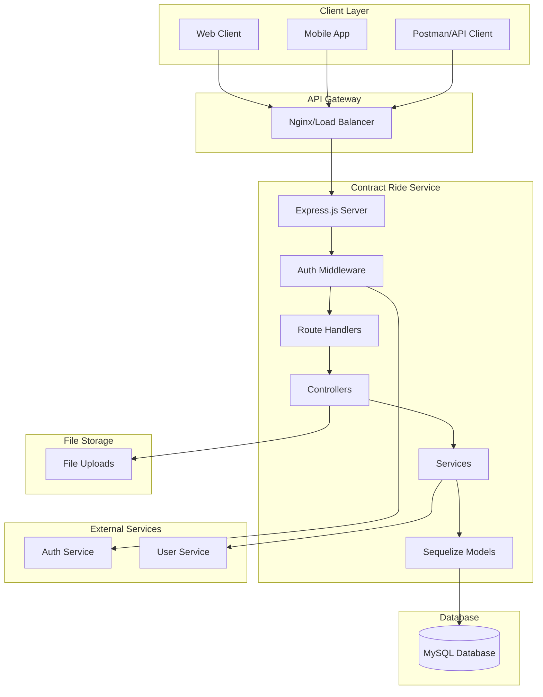

## Database Schema

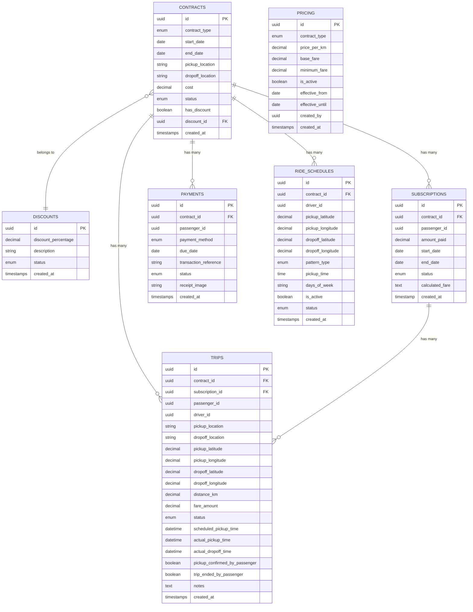

## User Authentication Flow

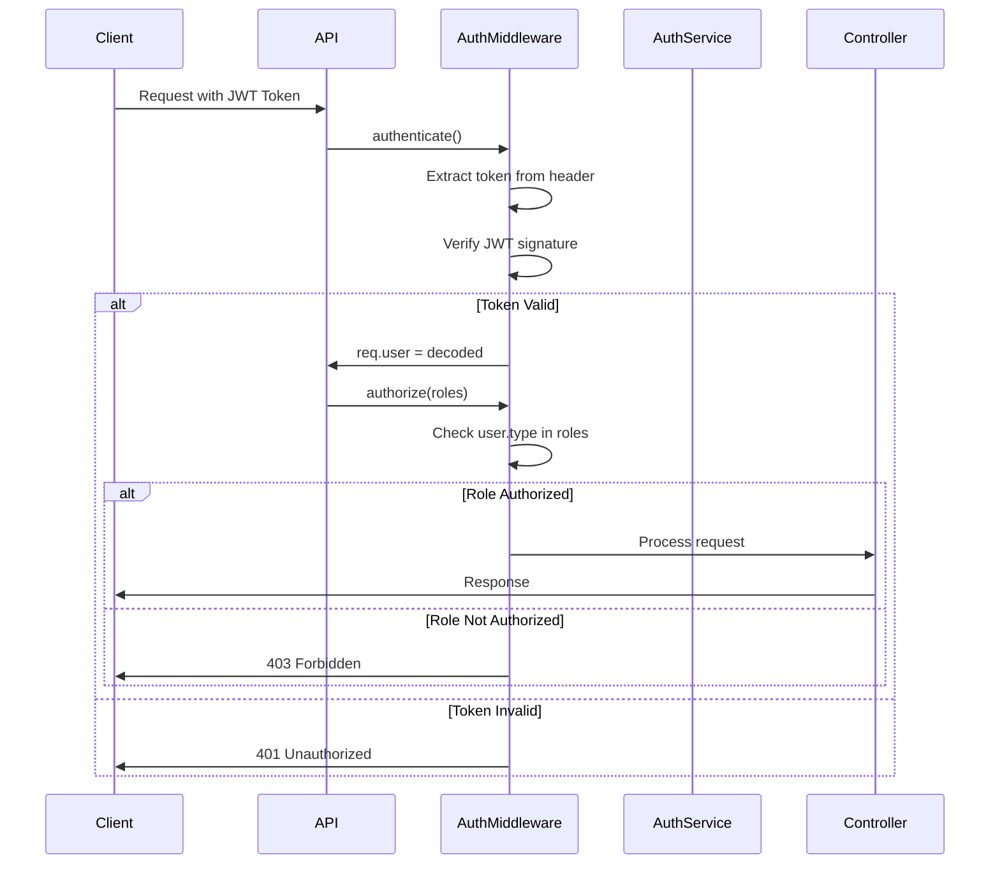

## Core Business Workflows

### 1. Contract Creation Workflow

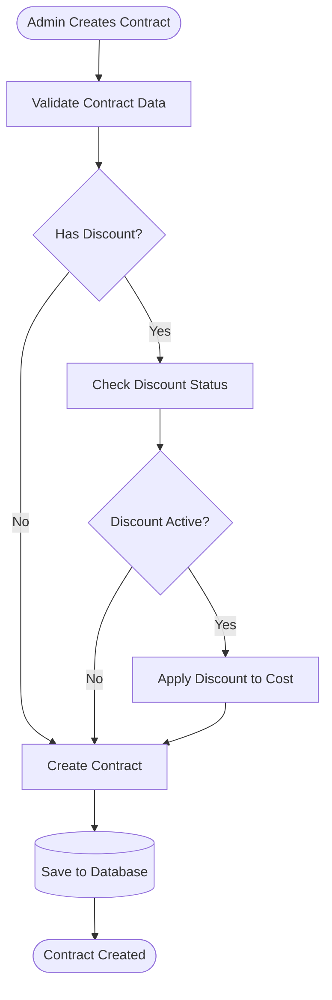

### 2. Subscription Creation Workflow

```mermaid
flowchart TD
    START([Passenger Creates Subscription]) --> INPUT[Input: Contract ID, Passenger ID, Coordinates]
    INPUT --> VALIDATE_CONTRACT[Validate Contract Exists]
    VALIDATE_CONTRACT --> COORDINATES{Coordinates Provided?}
    
    COORDINATES -->|Yes| CALC_DISTANCE[Calculate Distance]
    COORDINATES -->|No| USE_CONTRACT_COST[Use Existing Contract Cost]
    
    CALC_DISTANCE --> GET_PRICING[Get Active Pricing Rules]
    GET_PRICING --> CALC_FARE[Calculate Fare]
    CALC_FARE --> MONTHLY_COST[Calculate Monthly Cost (22 days)]
    MONTHLY_COST --> UPDATE_CONTRACT[Update Contract Cost]
    UPDATE_CONTRACT --> DETERMINE_STATUS[Determine Subscription Status]
    
    USE_CONTRACT_COST --> DETERMINE_STATUS
    
    DETERMINE_STATUS --> PAID_FULL{Amount >= Cost?}
    PAID_FULL -->|Yes| ACTIVE[Status: ACTIVE]
    PAID_FULL -->|No| PARTIAL{Amount > 0?}
    
    PARTIAL -->|Yes| PARTIAL_STATUS[Status: PARTIAL]
    PARTIAL -->|No| PENDING[Status: PENDING]
    
    ACTIVE --> SAVE_SUB[(Save Subscription)]
    PARTIAL_STATUS --> SAVE_SUB
    PENDING --> SAVE_SUB
    
    SAVE_SUB --> SUCCESS([Subscription Created])
```

### 3. Trip Lifecycle Workflow

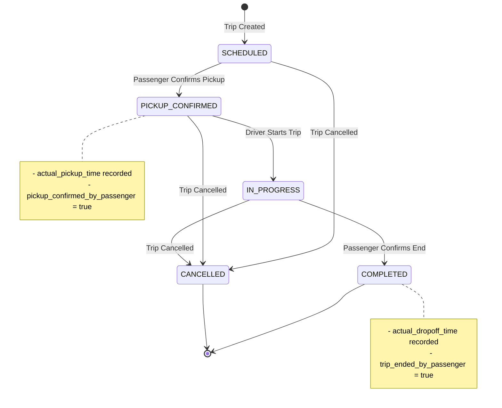

## API Request Flow

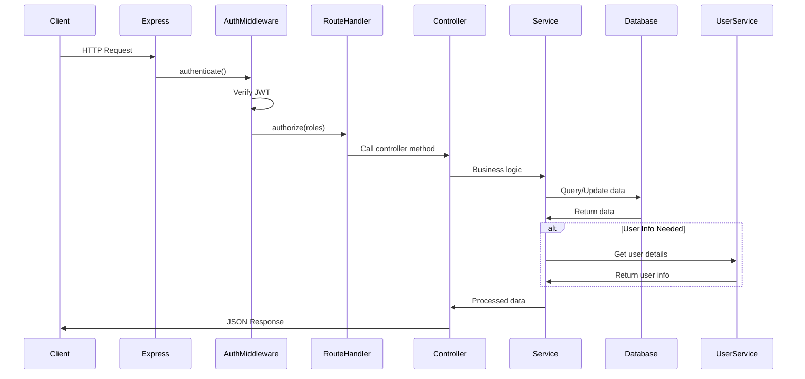

## Data Flow Diagrams

### 1. Passenger Trip History Flow

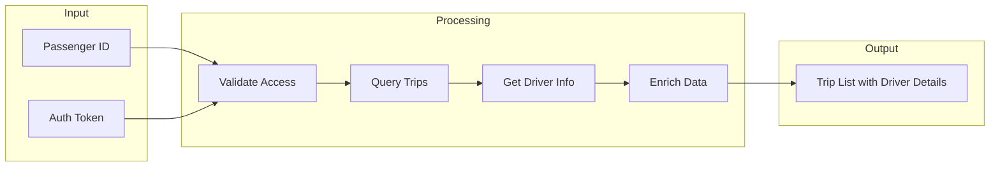

### 2. Pricing Calculation Flow

```mermaid
flowchart TD
    INPUT[Pickup/Dropoff Coordinates] --> DISTANCE[Calculate Distance]
    DISTANCE --> PRICING[Get Active Pricing]
    PRICING --> BASE[Base Fare]
    PRICING --> RATE[Rate per KM]
    PRICING --> MIN[Minimum Fare]
    
    BASE --> CALC[Calculate: Base + (Distance × Rate)]
    RATE --> CALC
    DISTANCE --> CALC
    
    CALC --> COMPARE[Compare with Minimum]
    MIN --> COMPARE
    COMPARE --> FINAL[Final Fare = MAX(Calculated, Minimum)]
```

## Sequence Diagrams

### 1. Complete Subscription Creation Process

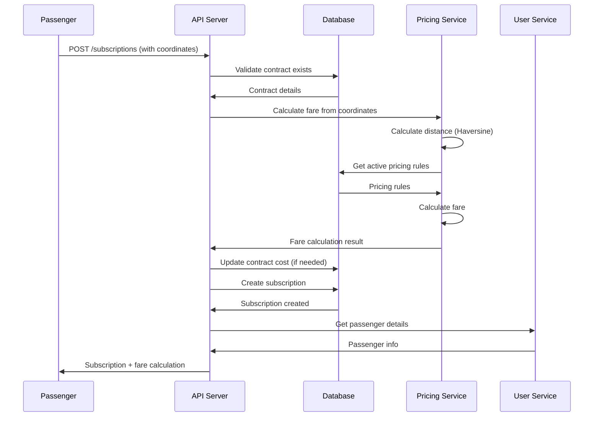

### 2. Driver Schedule Retrieval

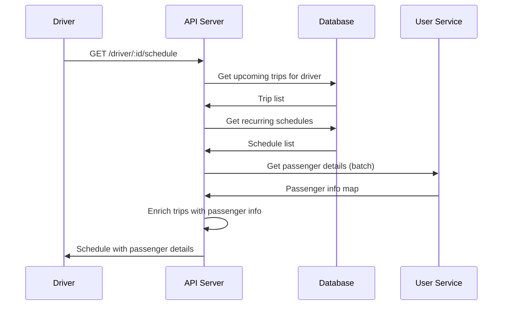

### 3. Trip Confirmation Flow

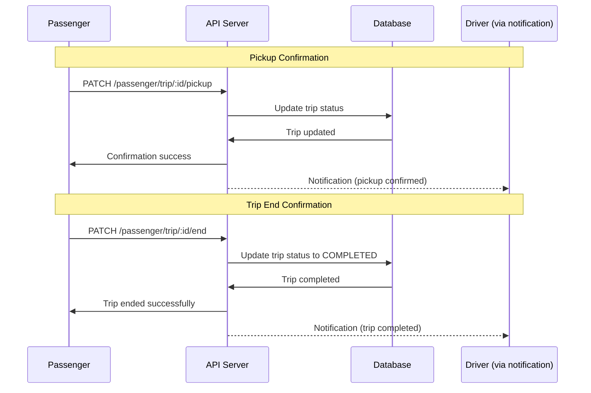

## File Structure and Component Flow

```
Contract Ride Service/
├── index.js                    # Entry point
├── config/
│   └── dbconfig.js             # Database configuration
├── middleware/
│   ├── auth.js                 # Authentication & Authorization
│   ├── errorHandler.js         # Error handling
│   └── dateValidation.js       # Date validation
├── models/                     # Database models
│   ├── indexModel.js           # Model exports & associations
│   ├── contractModel.js
│   ├── subscriptionModel.js
│   ├── tripModel.js
│   └── pricingModel.js
├── controllers/                # Business logic
│   ├── contractController.js
│   ├── passengerController.js
│   ├── driverController.js
│   └── adminController.js
├── routes/                     # Route definitions
│   ├── indexRoutes.js          # Main router
│   ├── contractRoutes.js
│   ├── passengerRoutes.js
│   └── driverRoutes.js
├── utils/                      # Utility functions
│   ├── userService.js          # External user API calls
│   ├── pricingService.js       # Fare calculation
│   └── fileHelper.js           # File operations
└── docs/                       # Documentation
    ├── PROJECT_WORKFLOW.md
    └── NEW_ENDPOINTS.md
```

## Key Integration Points

### 1. External Auth Service Integration
- **Purpose**: User authentication and profile data
- **Endpoints**: `/auth/admin/login`, `/auth/passenger/login`, `/auth/driver/login`
- **Integration**: JWT token validation and user profile enrichment

### 2. User Service Integration
- **Purpose**: Fetch detailed user information
- **Functions**: `getPassengerById()`, `getDriverById()`, `getStaffById()`
- **Usage**: Enrich API responses with user details

### 3. File Upload Integration
- **Purpose**: Handle payment receipt uploads
- **Storage**: Local filesystem under `/uploads`
- **Types**: Images (JPEG, PNG, GIF, WebP)

## Environment Configuration

```bash
# Database
DB_HOST=localhost
DB_NAME=contract_service_db
DB_USER=root
DB_PASSWORD=123

# Server
PORT=3000

# JWT
JWT_SECRET=your_jwt_secret
JWT_EXPIRES_IN=7d

# Auth Service Integration
AUTH_BASE_URL=https://authservice.capitalinvestmenttradingplc.com/api
PASSENGER_LOOKUP_URL_TEMPLATE=${AUTH_BASE_URL}/passengers/{id}
DRIVER_LOOKUP_URL_TEMPLATE=${AUTH_BASE_URL}/drivers/{id}
AUTH_SERVICE_BEARER=your_service_bearer_token

# JWT Verification
JWT_ISSUER=https://authservice.capitalinvestmenttradingplc.com/
JWT_AUDIENCE=my-api
```

## Deployment Flow

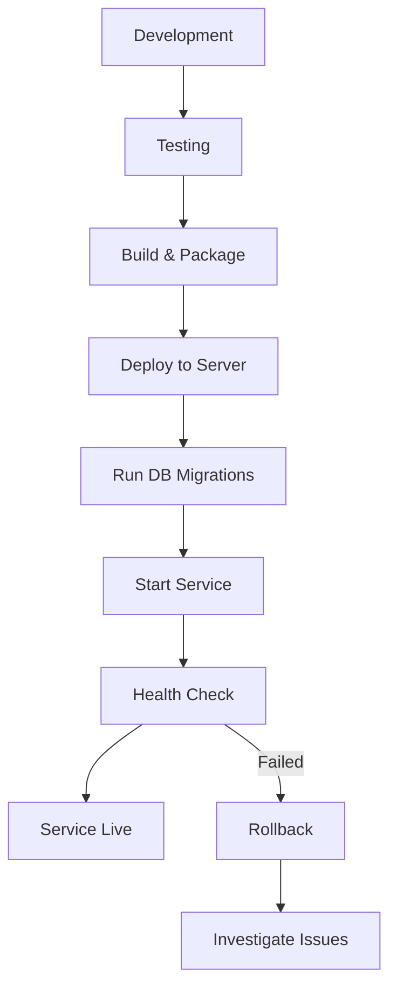

This comprehensive workflow documentation provides a complete understanding of how the Contract Ride Service operates, from high-level architecture to detailed sequence flows. Each diagram illustrates different aspects of the system's operation and can be used for development, debugging, and system understanding.